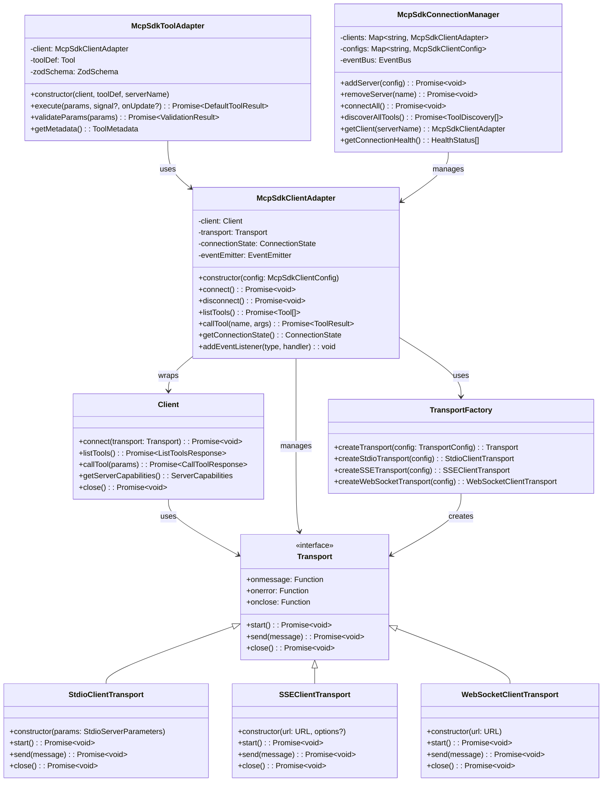
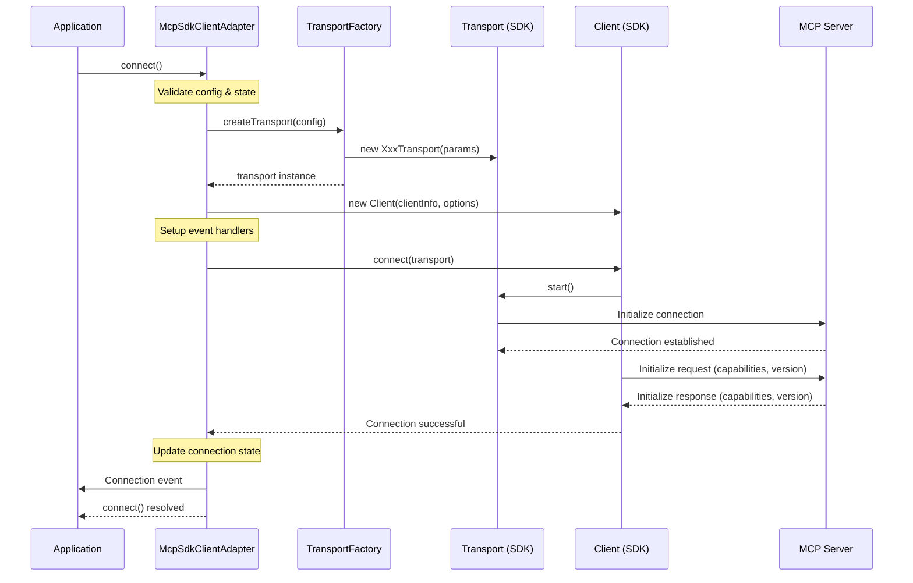
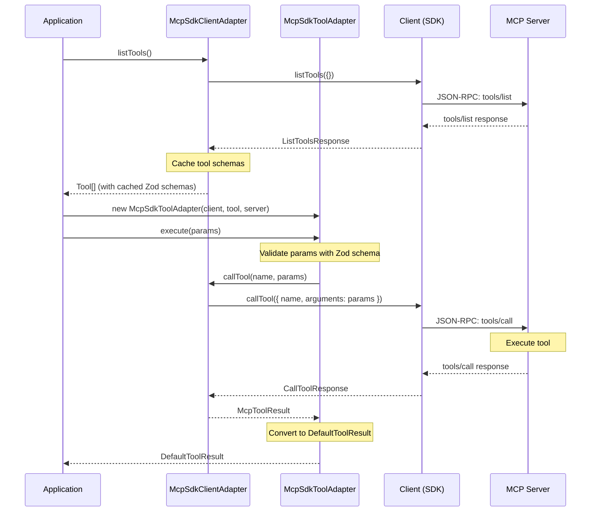
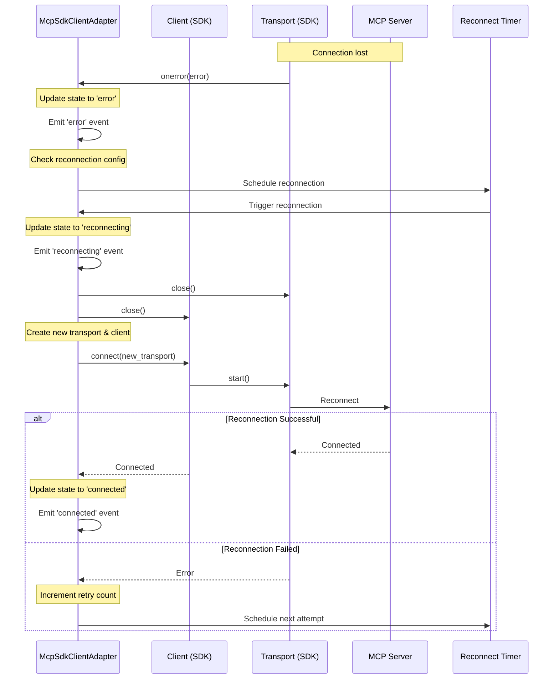

# Complete MCP SDK Architecture Design

## Executive Summary

This document presents a comprehensive architecture for MCP (Model Context Protocol) integration using the official `@modelcontextprotocol/sdk`. The architecture is designed to leverage the SDK's native capabilities while providing a thin adaptation layer for MiniAgent integration.

### Key Architecture Principles

1. **SDK-First Approach**: Use ONLY official SDK classes and methods
2. **Zero Custom Protocol Implementation**: No custom JSON-RPC or transport logic
3. **Thin Adapter Pattern**: Minimal wrapper around SDK functionality
4. **Type Safety**: Full TypeScript integration with SDK types
5. **Event-Driven Architecture**: Leverage SDK's event model
6. **Connection State Management**: Use SDK's native connection handling

## 1. SDK Analysis & Component Overview

### 1.1 Official SDK Structure

Based on analysis of `@modelcontextprotocol/sdk`, the key components are:

```
@modelcontextprotocol/sdk/
├── client/
│   ├── index.js        # Client class (main interface)
│   ├── stdio.js        # StdioClientTransport
│   ├── sse.js          # SSEClientTransport  
│   ├── websocket.js    # WebSocketClientTransport
│   └── streamableHttp.js # StreamableHTTPClientTransport
├── shared/
│   ├── protocol.js     # Protocol base class
│   └── transport.js    # Transport interface
├── types.js           # All MCP type definitions
└── server/           # Server-side components (not used in client)
```

### 1.2 Core SDK Classes

#### Client Class
```typescript
class Client<RequestT, NotificationT, ResultT> extends Protocol {
  constructor(clientInfo: Implementation, options?: ClientOptions)
  connect(transport: Transport, options?: RequestOptions): Promise<void>
  getServerCapabilities(): ServerCapabilities | undefined
  getServerVersion(): Implementation | undefined
  getInstructions(): string | undefined
  
  // Tool operations
  listTools(params: ListToolsRequest["params"]): Promise<ListToolsResponse>
  callTool(params: CallToolRequest["params"]): Promise<CallToolResponse>
  
  // Resource operations  
  listResources(params: ListResourcesRequest["params"]): Promise<ListResourcesResponse>
  readResource(params: ReadResourceRequest["params"]): Promise<ReadResourceResponse>
  
  // Other operations
  ping(options?: RequestOptions): Promise<PingResponse>
  complete(params: CompleteRequest["params"]): Promise<CompleteResponse>
  setLoggingLevel(level: LoggingLevel): Promise<void>
}
```

#### Transport Interface
```typescript
interface Transport {
  start(): Promise<void>
  send(message: JSONRPCMessage, options?: TransportSendOptions): Promise<void>
  close(): Promise<void>
  
  // Event callbacks
  onclose?: () => void
  onerror?: (error: Error) => void
  onmessage?: (message: JSONRPCMessage, extra?: MessageExtraInfo) => void
  
  // Optional properties
  sessionId?: string
  setProtocolVersion?(version: string): void
}
```

#### Transport Implementations
1. **StdioClientTransport**: Process-based communication
2. **SSEClientTransport**: Server-Sent Events over HTTP
3. **WebSocketClientTransport**: WebSocket communication
4. **StreamableHTTPClientTransport**: HTTP streaming

## 2. Comprehensive Architecture Design

### 2.1 Class Hierarchy & SDK Integration



### 2.2 Interface Definitions

```typescript
// Core adapter configuration extending SDK patterns
export interface McpSdkClientConfig {
  // Server identification
  serverName: string;
  
  // Client information (passed to SDK Client constructor)
  clientInfo: Implementation;
  
  // Client capabilities (passed to SDK Client options)
  capabilities?: ClientCapabilities;
  
  // Transport configuration (used by our TransportFactory)
  transport: McpSdkTransportConfig;
  
  // Enhanced features beyond basic SDK
  reconnection?: ReconnectionConfig;
  healthCheck?: HealthCheckConfig;
  timeouts?: TimeoutConfig;
  logging?: LoggingConfig;
}

// Transport configuration matching SDK transport options
export type McpSdkTransportConfig = 
  | McpSdkStdioTransportConfig
  | McpSdkSSETransportConfig  
  | McpSdkWebSocketTransportConfig
  | McpSdkStreamableHttpTransportConfig;

export interface McpSdkStdioTransportConfig {
  type: 'stdio';
  // Direct mapping to SDK StdioServerParameters
  command: string;
  args?: string[];
  env?: Record<string, string>;
  cwd?: string;
  stderr?: IOType | Stream | number;
}

export interface McpSdkSSETransportConfig {
  type: 'sse';
  // Direct mapping to SDK SSEClientTransportOptions
  url: string;
  headers?: Record<string, string>;
  fetch?: FetchLike;
  authorizationUrl?: URL;
  authorizationHandler?: (authUrl: URL) => Promise<string>;
}

export interface McpSdkWebSocketTransportConfig {
  type: 'websocket';
  // Direct mapping to SDK WebSocketClientTransport constructor
  url: string;
}

export interface McpSdkStreamableHttpTransportConfig {
  type: 'streamable-http';
  // Direct mapping to SDK StreamableHTTPClientTransportOptions  
  url: string;
  headers?: Record<string, string>;
  fetch?: FetchLike;
  reconnection?: ReconnectionOptions;
  authorizationUrl?: URL;
  authorizationHandler?: (authUrl: URL) => Promise<string>;
}
```

### 2.3 Connection State Management

The architecture uses the SDK's native connection model with enhanced state tracking:

```typescript
// Connection states based on SDK behavior
export type McpConnectionState = 
  | 'disconnected'    // Initial state, transport not created
  | 'connecting'      // Transport created, connect() called
  | 'initializing'    // Connected, initialization handshake in progress
  | 'connected'       // Fully initialized and ready
  | 'reconnecting'    // Attempting reconnection
  | 'error'           // Connection error state
  | 'disposed';       // Client disposed, cannot reconnect

export interface McpConnectionStatus {
  state: McpConnectionState;
  serverName: string;
  connectedAt?: Date;
  lastActivity?: Date;
  errorCount: number;
  lastError?: McpSdkError;
  
  // SDK-provided information
  serverVersion?: Implementation;
  serverCapabilities?: ServerCapabilities;
  serverInstructions?: string;
  sessionId?: string;
}
```

### 2.4 Event System Integration

The architecture integrates with the SDK's notification system and adds structured events:

```typescript
// Events emitted by SDK Client (via notification handlers)
export interface McpSdkClientEvents {
  // Connection lifecycle (generated by our adapter)
  'connected': { serverName: string; capabilities: ServerCapabilities };
  'disconnected': { serverName: string; reason?: string };
  'reconnecting': { serverName: string; attempt: number };
  'error': { serverName: string; error: McpSdkError };
  
  // SDK notification events (forwarded from Client)
  'tools/list_changed': { serverName: string };
  'resources/list_changed': { serverName: string };
  'resources/updated': { serverName: string; uri: string };
  
  // Custom events
  'health_check': { serverName: string; healthy: boolean; responseTime: number };
  'tool_execution': { serverName: string; toolName: string; duration: number; success: boolean };
}
```

## 3. Sequence Diagrams for Key Operations

### 3.1 Client Connection Flow



### 3.2 Tool Discovery and Execution Flow



### 3.3 Connection Recovery Flow



## 4. Error Handling Strategy

### 4.1 SDK Error Integration

The architecture wraps all SDK errors in a consistent error hierarchy:

```typescript
export class McpSdkError extends Error {
  constructor(
    message: string,
    public readonly code: McpErrorCode,
    public readonly serverName: string,
    public readonly operation?: string,
    public readonly sdkError?: unknown,  // Original SDK error
    public readonly context?: Record<string, unknown>
  ) {
    super(message);
    this.name = 'McpSdkError';
  }

  // Factory methods for different SDK error scenarios
  static fromTransportError(error: unknown, serverName: string): McpSdkError;
  static fromClientError(error: unknown, serverName: string, operation: string): McpSdkError;
  static fromProtocolError(error: JSONRPCError, serverName: string, operation: string): McpSdkError;
}
```

### 4.2 Error Propagation Patterns

1. **Transport Errors**: Caught via transport.onerror callback
2. **Protocol Errors**: Caught from Client method rejections  
3. **Timeout Errors**: Generated using Promise.race with timers
4. **Validation Errors**: Generated during parameter validation

## 5. Resource Management

### 5.1 Connection Lifecycle

```typescript
export class McpSdkClientAdapter {
  private client?: Client;
  private transport?: Transport;
  private disposed = false;
  private reconnectTimer?: NodeJS.Timeout;
  private healthCheckTimer?: NodeJS.Timeout;

  async connect(): Promise<void> {
    if (this.disposed) throw new Error('Client disposed');
    if (this.isConnected()) return;
    
    // Create SDK client and transport
    this.client = new Client(this.config.clientInfo, {
      capabilities: this.config.capabilities
    });
    
    this.transport = this.createTransport();
    this.setupEventHandlers();
    
    // Use SDK's native connect method
    await this.client.connect(this.transport);
    
    this.updateState('connected');
    this.startHealthCheck();
  }

  async disconnect(): Promise<void> {
    this.clearTimers();
    
    try {
      // Use SDK's native close methods
      if (this.client) await this.client.close();
      if (this.transport) await this.transport.close();
    } finally {
      this.client = undefined;
      this.transport = undefined;
      this.updateState('disconnected');
    }
  }

  async dispose(): Promise<void> {
    this.disposed = true;
    await this.disconnect();
    this.removeAllListeners();
  }
}
```

### 5.2 Memory Management

- **Schema Caching**: Cache Zod schemas with LRU eviction
- **Connection Pooling**: Reuse connections across tool executions
- **Event Listener Cleanup**: Proper cleanup of SDK event handlers
- **Timer Management**: Clear all timers on disconnect/dispose

## 6. Performance Optimizations

### 6.1 Schema Caching Strategy

```typescript
export class SchemaCache {
  private cache = new LRUCache<string, CachedSchema>({ max: 1000 });

  cacheToolSchema(serverName: string, toolName: string, jsonSchema: Schema): ZodSchema {
    const cacheKey = `${serverName}:${toolName}`;
    const cached = this.cache.get(cacheKey);
    
    if (cached && cached.hash === this.hashSchema(jsonSchema)) {
      return cached.zodSchema;
    }
    
    const zodSchema = this.jsonSchemaToZod(jsonSchema);
    this.cache.set(cacheKey, {
      jsonSchema,
      zodSchema,
      hash: this.hashSchema(jsonSchema),
      timestamp: Date.now()
    });
    
    return zodSchema;
  }
}
```

### 6.2 Connection Management

```typescript
export class McpSdkConnectionManager {
  private clients = new Map<string, McpSdkClientAdapter>();
  private maxConnections = 50;
  
  async getClient(serverName: string): Promise<McpSdkClientAdapter> {
    let client = this.clients.get(serverName);
    
    if (!client) {
      if (this.clients.size >= this.maxConnections) {
        await this.evictLeastRecentlyUsed();
      }
      
      client = new McpSdkClientAdapter(this.getConfig(serverName));
      await client.connect();
      this.clients.set(serverName, client);
    }
    
    if (!client.isConnected()) {
      await client.connect();
    }
    
    return client;
  }
}
```

## 7. Implementation Phases

### Phase 1: Core SDK Integration
1. **McpSdkClientAdapter**: Basic wrapper around SDK Client
2. **TransportFactory**: Factory for SDK transport instances
3. **Basic error handling**: Wrap SDK errors consistently
4. **Connection management**: Connect, disconnect, state tracking

### Phase 2: Tool Integration  
1. **McpSdkToolAdapter**: Bridge to MiniAgent BaseTool
2. **Schema management**: JSON Schema to Zod conversion
3. **Parameter validation**: Runtime validation with Zod
4. **Result transformation**: SDK results to MiniAgent format

### Phase 3: Advanced Features
1. **McpSdkConnectionManager**: Multi-server management
2. **Health checking**: Periodic connection health monitoring
3. **Reconnection logic**: Automatic reconnection with backoff
4. **Performance optimization**: Caching and connection pooling

### Phase 4: Integration & Testing
1. **MiniAgent integration**: Register with CoreToolScheduler
2. **Comprehensive testing**: Unit tests, integration tests
3. **Performance testing**: Load testing, memory profiling
4. **Documentation**: API docs, examples, migration guide

## 8. Migration Strategy

### 8.1 Backwards Compatibility

The new SDK-based architecture maintains compatibility with existing MCP interfaces:

```typescript
// Legacy interface (maintained for compatibility)
export interface IMcpClient {
  // ... existing methods
}

// New SDK adapter implements legacy interface
export class McpSdkClientAdapter implements IMcpClient {
  // SDK-based implementation of legacy interface
}

// Factory function for seamless migration
export function createMcpClient(config: McpClientConfig): IMcpClient {
  return new McpSdkClientAdapter(convertConfig(config));
}
```

### 8.2 Feature Parity Matrix

| Feature | Legacy Implementation | SDK Implementation | Status |
|---------|----------------------|-------------------|---------|
| STDIO Transport | Custom | SDK StdioClientTransport | ✅ Enhanced |
| HTTP Transport | Custom | SDK SSE/StreamableHttp | ✅ Enhanced |
| Tool Discovery | Custom JSON-RPC | SDK listTools() | ✅ Enhanced |
| Tool Execution | Custom JSON-RPC | SDK callTool() | ✅ Enhanced |
| Resource Access | Custom JSON-RPC | SDK listResources/readResource | ✅ New |
| Error Handling | Basic | SDK + Enhanced | ✅ Enhanced |
| Reconnection | Manual | SDK + Automatic | ✅ Enhanced |
| Health Checks | None | SDK ping() + Custom | ✅ New |

## 9. Testing Strategy

### 9.1 Unit Testing

```typescript
describe('McpSdkClientAdapter', () => {
  let client: McpSdkClientAdapter;
  let mockTransport: jest.Mocked<Transport>;
  let mockSdkClient: jest.Mocked<Client>;

  beforeEach(() => {
    mockTransport = createMockTransport();
    mockSdkClient = createMockSdkClient();
    
    jest.spyOn(TransportFactory, 'create').mockReturnValue(mockTransport);
    jest.spyOn(Client, 'constructor').mockReturnValue(mockSdkClient);
    
    client = new McpSdkClientAdapter(testConfig);
  });

  it('should connect using SDK client', async () => {
    await client.connect();
    
    expect(mockSdkClient.connect).toHaveBeenCalledWith(mockTransport);
    expect(client.getConnectionState()).toBe('connected');
  });

  it('should handle SDK connection errors', async () => {
    const error = new Error('SDK connection failed');
    mockSdkClient.connect.mockRejectedValue(error);
    
    await expect(client.connect()).rejects.toThrow(McpSdkError);
    expect(client.getConnectionState()).toBe('error');
  });
});
```

### 9.2 Integration Testing

```typescript
describe('MCP SDK Integration', () => {
  let server: MockMcpServer;
  let client: McpSdkClientAdapter;

  beforeAll(async () => {
    server = new MockMcpServer();
    await server.start();
  });

  it('should perform full tool discovery and execution flow', async () => {
    client = new McpSdkClientAdapter({
      serverName: 'test',
      transport: { type: 'stdio', command: server.command }
    });

    await client.connect();
    
    const tools = await client.listTools();
    expect(tools).toHaveLength(3);
    
    const result = await client.callTool('test_tool', { input: 'test' });
    expect(result.content).toBeDefined();
  });
});
```

## 10. Conclusion

This architecture provides a complete, production-ready MCP integration that:

1. **Leverages Official SDK**: Uses only official SDK classes and methods
2. **Maintains Type Safety**: Full TypeScript integration with SDK types
3. **Provides Enhanced Features**: Adds reconnection, health checks, caching
4. **Ensures Compatibility**: Maintains existing MiniAgent interface contracts
5. **Enables Performance**: Connection pooling, schema caching, batching
6. **Supports All Transports**: STDIO, SSE, WebSocket, StreamableHTTP

The implementation follows the thin adapter pattern, wrapping SDK functionality with minimal additional logic while providing the enhanced features required for production use in MiniAgent.

The next step is to implement this architecture following the detailed specifications provided in this document.