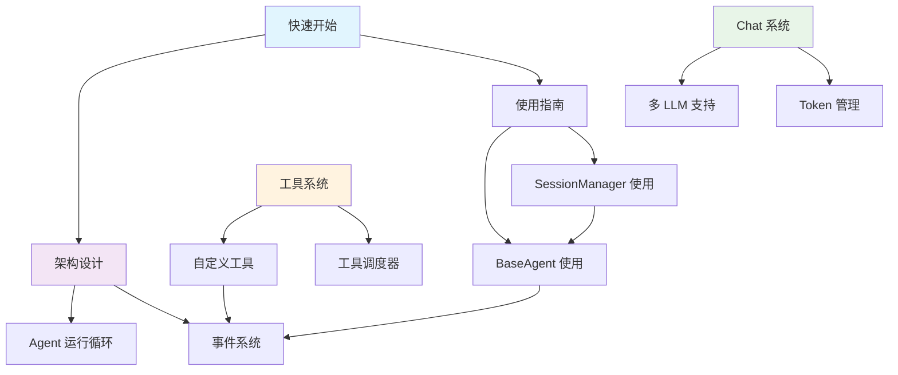

# MiniAgent 文档

欢迎使用 MiniAgent 文档！这里包含了使用 MiniAgent 框架所需的所有文档资料。

## 📚 文档结构

### 🚀 快速开始
- **[快速开始指南](./quickstart.md)** - 5分钟快速上手，了解基本使用方法

### 🏗️ 架构设计
- **[架构概览](./architecture/)** - 框架核心设计和工作原理
  - [Agent 运行循环](./architecture/agent-loop.md) - 深入理解 Agent Loop 的工作机制
  - [事件系统](./architecture/event-system.md) - 事件驱动架构的完整说明

### 💬 Chat Provider 系统
- **[Chat 系统](./chat/)** - 多 LLM 支持和响应处理
  - Chat Provider 概览 - 统一的多 LLM 接口 *(开发中)*
  - Token 管理 - 使用量追踪和优化 *(开发中)*

### 🛠️ 工具系统  
- **[工具系统](./tool-system/)** - 自定义工具开发和管理
  - [自定义工具](./tool-system/custom-tools.md) - 完整的工具定义和实现指南
  - 工具调度器 - 并行执行和调度机制 *(开发中)*

### 📖 使用指南
- **[BaseAgent 使用指南](./baseagent-usage.md)** - 核心 Agent 功能使用手册
- **[SessionManager 使用指南](./session-manager-usage.md)** - 多会话管理和状态持久化

## 🎯 快速导航

### 新手入门路径
1. 📖 [快速开始](./quickstart.md) - 了解基本概念和使用方法
2. 🏗️ [架构概览](./architecture/) - 理解框架设计原理  
3. 🛠️ 选择适合的使用指南：
   - [BaseAgent 使用](./baseagent-usage.md) - 核心功能使用
   - [SessionManager 使用](./session-manager-usage.md) - 会话管理

### 开发者路径
- **核心开发**: [BaseAgent 使用指南](./baseagent-usage.md)
- **工具开发**: [工具系统](./tool-system/) → [自定义工具](./tool-system/custom-tools.md)
- **架构理解**: [架构设计](./architecture/) → [Agent 运行循环](./architecture/agent-loop.md)
- **事件处理**: [事件系统](./architecture/event-system.md)

### 高级用户路径  
- **多会话管理**: [SessionManager 使用指南](./session-manager-usage.md)
- **性能优化**: [架构设计](./architecture/agent-loop.md#性能优化策略)
- **扩展开发**: [工具系统](./tool-system/) + [Chat 系统](./chat/)

## 🔄 文档关系图



## 📋 功能特性速览

### 🤖 Agent 核心
- **多 LLM 支持**: Gemini、OpenAI、o1 系列
- **流式响应**: 实时文本输出和状态反馈
- **事件驱动**: 完整的执行状态监控
- **异步处理**: 非阻塞的高性能架构

### 🛠️ 工具系统
- **自定义工具**: 灵活的工具定义接口
- **并行执行**: 多工具同时执行优化
- **安全确认**: 危险操作的确认机制
- **状态追踪**: 完整的工具执行监控

### 💬 会话管理
- **多会话**: 独立的对话上下文管理
- **状态持久化**: 会话数据的保存和恢复
- **智能清理**: 自动的内存和 Token 优化
- **事件监控**: 会话级别的状态追踪

### 📊 性能优化
- **Token 追踪**: 实时使用量统计和警告
- **缓存机制**: OpenAI 响应缓存优化
- **智能截断**: 自动的历史记录管理
- **并发控制**: 合理的资源使用限制

## 🎨 代码示例速查

### 基础使用
```typescript
import { StandardAgent } from '@continue-reasoning/mini-agent';

const agent = new StandardAgent([], {
  chatProvider: 'gemini',
  agentConfig: { 
    apiKey: process.env.GEMINI_API_KEY,
    model: 'gemini-2.0-flash'
  }
});

// 简单对话
for await (const event of agent.processWithSession("Hello!")) {
  if (event.type === 'response.chunk.text.done') {
    console.log('AI:', event.data.content.text);
  }
}
```

### 多会话管理
```typescript
// 创建不同会话
const session1 = agent.createNewSession("User Chat");
const session2 = agent.createNewSession("Admin Console");

// 独立的对话上下文
await agent.processWithSession("帮我写代码", session1);
await agent.processWithSession("系统状态检查", session2);
```

### 自定义工具
```typescript
const weatherTool: ITool = {
  name: 'get_weather',
  description: 'Get weather information',
  // ... 工具实现
};

const agent = new StandardAgent([weatherTool], config);
```

## 🔍 常见问题速查

### 模型选择
- **gemini-2.0-flash**: 快速、经济，适合大多数场景
- **gpt-4o**: 功能强大，适合复杂推理任务  
- **o1 系列**: 支持深度思考，适合需要复杂分析的场景

### 性能优化
- 监控 Token 使用量避免超限
- 使用会话管理分割不同主题
- 合理配置工具并行数量
- 启用缓存机制提升响应速度

### 错误处理
- 监听 `response.failed` 事件实现重试
- 使用 AbortSignal 支持操作取消
- 实现工具执行失败的降级策略

## 💡 使用建议

### 学习路径建议
1. **初学者**: 快速开始 → BaseAgent 使用 → 简单工具开发
2. **进阶用户**: 架构理解 → 事件系统 → 高级会话管理
3. **专业开发**: 完整架构 → 自定义扩展 → 性能优化

### 实践建议
- 从简单的 demo 开始，逐步增加复杂性
- 充分利用事件系统进行状态监控
- 合理使用会话管理提升用户体验
- 注意安全性，特别是涉及文件操作的工具

## 🤝 贡献文档

如果您发现文档有误或需要改进，欢迎：
1. 提交 Issue 报告问题
2. 提交 Pull Request 改进文档
3. 分享使用经验和最佳实践

---

**开始探索 MiniAgent 的强大功能吧！** 🚀

> 💡 提示：推荐从[快速开始指南](./quickstart.md)开始您的 MiniAgent 之旅！