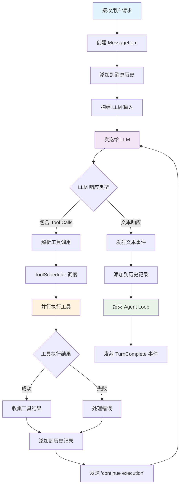
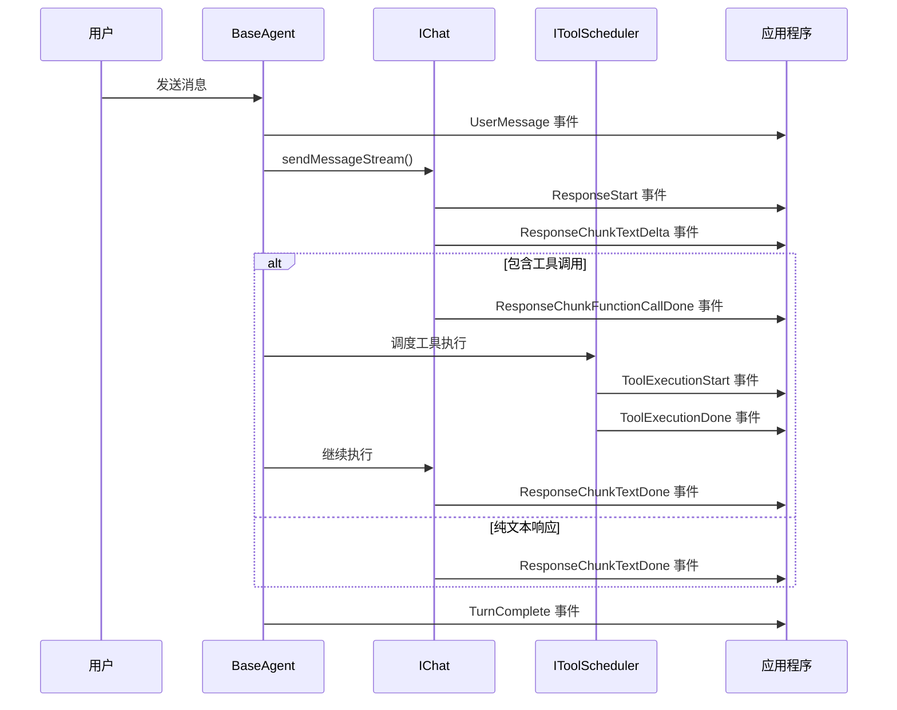

# Agent 运行原理

## 概述

MiniAgent 的核心是一个基于事件驱动的异步处理循环（Agent Loop），它协调用户输入、LLM 响应和工具执行，实现智能对话和任务处理。

## 架构图

```
┌─────────────────────────────────────────────────────────────────┐
│                        MiniAgent 架构                            │
├─────────────────────────────────────────────────────────────────┤
│                                                                 │
│  ┌─────────────┐    ┌─────────────┐    ┌─────────────────────┐  │
│  │             │    │             │    │                     │  │
│  │   用户输入   │───▶│  BaseAgent  │───▶│   AgentEvent 流      │  │
│  │             │    │             │    │                     │  │
│  └─────────────┘    └─────────────┘    └─────────────────────┘  │
│                            │                                    │
│                            ▼                                    │
│  ┌─────────────────────────────────────────────────────────────┐  │
│  │                   Agent Loop 核心                           │  │
│  │                                                             │  │
│  │  ┌─────────────┐  ┌──────────────┐  ┌─────────────────┐   │  │
│  │  │    IChat    │  │ IToolScheduler│  │  TokenTracker   │   │  │
│  │  │  (LLM通信)   │  │  (工具调度)    │  │  (Token追踪)     │   │  │
│  │  └─────────────┘  └──────────────┘  └─────────────────┘   │  │
│  │         │                 │                    │           │  │
│  │         ▼                 ▼                    ▼           │  │
│  │  ┌─────────────┐  ┌──────────────┐  ┌─────────────────┐   │  │
│  │  │ GeminiChat  │  │ CoreToolSche │  │  内存管理        │   │  │
│  │  │ OpenAIChat  │  │    duler     │  │  性能监控        │   │  │
│  │  └─────────────┘  └──────────────┘  └─────────────────┘   │  │
│  └─────────────────────────────────────────────────────────────┘  │
│                                                                 │
└─────────────────────────────────────────────────────────────────┘
```

## Agent Loop 流程图



## 详细执行步骤

### 1. 接收用户请求

```typescript
// BaseAgent.process() 方法入口
async *process(
  userMessages: {role: 'user', content: ContentPart, metadata?: {sessionId: string, previousResponseId?: string}}[],
  sessionId: string,
  abortSignal: AbortSignal,
): AsyncGenerator<AgentEvent>
```

**处理过程：**
1. 验证 Agent 运行状态
2. 增加 turn 计数器
3. 创建 MessageItem 对象
4. 发射 UserMessage 事件

### 2. 消息历史管理

```typescript
// 创建 MessageItem
const messageItems: MessageItem[] = userMessages.map((userMessage) => ({
  role: userMessage.role,
  content: userMessage.content,
  turnIdx: this.currentTurn,
  metadata: {
    ...userMessage.metadata,
    timestamp: Date.now(),
    turn: this.currentTurn,
  },
}));

// 添加到历史记录
this.chat.addHistory(messageItem);
```

### 3. LLM 通信

**发送消息给 LLM：**
```typescript
// BaseAgent.processOneTurn()
const llmResponseStream = this.chat.sendMessageStream(
  { role: 'user', content: { type: 'text', text: 'continue execution' } },
  promptId
);
```

**处理 LLM 响应流：**
- `response.start` - 响应开始
- `response.chunk.text.delta` - 文本增量更新  
- `response.chunk.function_call.done` - 工具调用完成
- `response.complete` - 响应完成

### 4. 工具调用处理

**解析工具调用：**
```typescript
if (llmResponse.type === 'response.chunk.function_call.done') {
  const toolCallRequests: IToolCallRequestInfo[] = // 解析工具调用
  
  // 调度工具执行
  await this.toolScheduler.schedule(toolCallRequests, abortSignal, {
    onExecutionStart: (toolCall) => {
      // 发射 ToolExecutionStart 事件
    },
    onExecutionDone: (request, response, duration) => {
      // 发射 ToolExecutionDone 事件
    }
  });
}
```

**ToolScheduler 执行流程：**
1. **验证工具参数** - `tool.validateToolParams()`
2. **检查确认需求** - `tool.shouldConfirmExecute()`
3. **并行执行工具** - `tool.execute()`
4. **收集执行结果** - 创建 `function_response` MessageItem
5. **添加到历史** - 更新对话上下文

### 5. 循环控制

**继续条件判断：**
```typescript
// 如果有工具调用，自动继续执行
if (hasToolCalls) {
  // 添加 "continue execution" 消息
  const continueMessage = {
    role: 'user' as const,
    content: { type: 'text' as const, text: 'continue execution' }
  };
  
  // 递归调用 processOneTurn
  yield* this.processOneTurn(sessionId, [continueMessage], abortSignal);
}
```

**退出条件：**
- LLM 只返回文本响应（无工具调用）
- 遇到错误或异常
- 收到中断信号（AbortSignal）
- 达到最大轮次限制

## 核心组件详解

### BaseAgent
- **职责**: 协调整个处理流程
- **关键方法**: 
  - `process()` - 主入口方法
  - `processOneTurn()` - 单轮对话处理
  - `createEvent()` - 事件创建和发射

### IChat 接口
- **GeminiChat**: Google Gemini API 实现
- **OpenAIChatResponse**: OpenAI Response API 实现
- **核心方法**:
  - `sendMessageStream()` - 发送消息流
  - `getHistory()` - 获取历史记录
  - `getTokenUsage()` - 获取 Token 使用情况

### IToolScheduler 接口
- **CoreToolScheduler**: 默认工具调度器实现
- **核心功能**:
  - 并行工具执行
  - 参数验证
  - 确认机制
  - 状态跟踪

### TokenTracker
- **功能**: 实时追踪 Token 使用量
- **特性**:
  - 输入/输出 Token 统计
  - 缓存命中率计算
  - 使用量警告
  - 模型限制检查

## 事件驱动机制

### 事件流转图



### 关键设计特点

1. **异步流式处理**
   - 基于 AsyncGenerator 的事件流
   - 实时响应，无需等待完整结果
   - 支持中断和取消操作

2. **状态管理**
   - 每轮对话的状态追踪
   - 历史记录自动管理
   - Token 使用量实时统计

3. **错误处理**
   - 分层错误处理机制
   - 优雅降级策略
   - 详细错误事件通知

4. **可扩展性**
   - 接口驱动设计
   - 插件式工具系统
   - 多 LLM 提供商支持

## 性能优化策略

### 1. 并发执行
- 多个工具并行执行
- 异步 I/O 操作
- 流式响应处理

### 2. 内存管理
- 历史记录自动截断
- Token 使用量监控
- 及时资源清理

### 3. 缓存机制
- LLM 响应缓存（OpenAI）
- 工具结果缓存
- 智能上下文复用

### 4. Token 优化
- 增量输入策略
- 历史压缩算法
- 缓存命中率优化

## 调试和监控

### 日志系统
```typescript
import { configureLogger, LogLevel } from '@mini-agent/core';

configureLogger({
  level: LogLevel.DEBUG,
  autoDetectContext: true,
  includeTimestamp: true,
  enableColors: true
});
```

### 事件监控
```typescript
// 监控所有事件
for await (const event of agent.process(userMessages, sessionId, signal)) {
  console.log(`Event: ${event.type}`, event.data);
  
  // 性能监控
  if (event.type === 'tool.call.execution.done') {
    console.log(`Tool execution time: ${event.data.duration}ms`);
  }
}
```

### 状态检查
```typescript
// 获取 Agent 状态
const status = agent.getStatus();
console.log('Current turn:', status.currentTurn);
console.log('Token usage:', status.tokenUsage);
console.log('Is running:', status.isRunning);
```

## 最佳实践

1. **合理设置超时**
   ```typescript
   const abortController = new AbortController();
   setTimeout(() => abortController.abort(), 30000);
   ```

2. **监控 Token 使用**
   ```typescript
   const usage = agent.getTokenUsage();
   if (usage.usagePercentage > 90) {
     console.warn('Approaching token limit!');
   }
   ```

3. **错误处理**
   ```typescript
   for await (const event of agent.process(messages, sessionId, signal)) {
     if (event.type === 'agent.error') {
       // 实现错误恢复逻辑
     }
   }
   ```

4. **资源清理**
   ```typescript
   // 清理长对话历史
   if (agent.getStatus().historySize > 100) {
     agent.clearHistory();
   }
   ```

通过理解这些核心原理，您可以更好地使用 MiniAgent 构建智能应用程序，并根据具体需求进行优化和扩展。