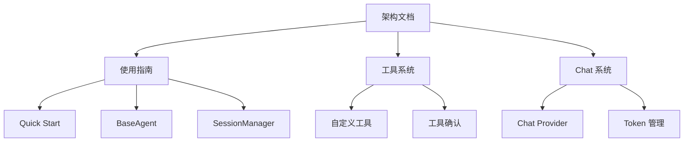

# 架构设计文档

本目录包含 MiniAgent 框架的核心架构设计文档，帮助开发者深入理解框架的内部工作原理。

## 📋 文档列表

### 核心架构
- **[Agent 运行循环](./agent-loop.md)** - 详细介绍 Agent Loop 的工作机制和执行流程
- **[事件系统](./event-system.md)** - Agent 事件驱动架构的完整说明

## 🎯 适用场景

### 深度学习
如果您需要：
- 理解 MiniAgent 的内部工作原理
- 扩展或自定义框架功能
- 进行性能优化
- 调试复杂问题

### 架构决策
文档涵盖的关键架构决策：
- 事件驱动设计的优势
- 异步流式处理机制
- 工具调度和执行策略
- 状态管理和持久化

## 🔄 与其他文档的关系

## 🚀 快速导航

### 新手入门
1. 先阅读 [Agent 运行循环](./agent-loop.md) 了解基本原理
2. 然后查看 [事件系统](./event-system.md) 理解事件处理

### 开发者参考
- **系统集成**: [事件系统](./event-system.md) 
- **性能优化**: [Agent 运行循环](./agent-loop.md#性能优化策略)
- **错误处理**: [事件系统](./event-system.md#最佳实践)

## 📊 架构概览

MiniAgent 采用现代化的事件驱动架构：

- **异步处理**: 基于 AsyncGenerator 的非阻塞操作
- **流式响应**: 实时处理和反馈机制
- **模块化设计**: 清晰的组件分离和接口抽象
- **可扩展性**: 支持自定义工具和 Chat Provider

## 💡 设计原则

### 简洁性
- 最小化核心 API 表面
- 直观的概念模型
- 清晰的代码结构

### 可扩展性
- 插件式架构
- 标准化接口
- 灵活的配置选项

### 可靠性
- 强类型约束
- 全面的错误处理
- 优雅降级策略

---

**探索 MiniAgent 的架构设计，理解框架的强大功能！**