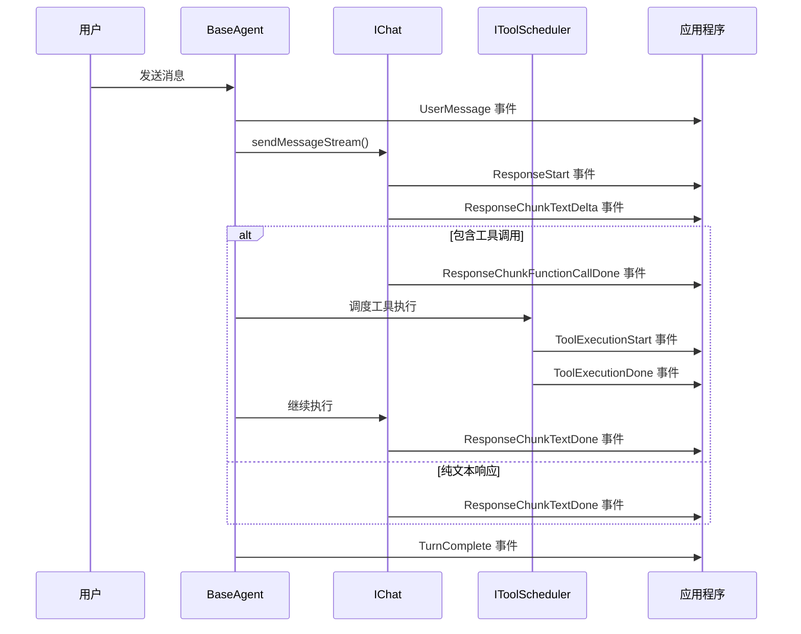

# Agent 事件系统

## 概述

MiniAgent 基于事件驱动架构，通过 AgentEvent 流提供实时的执行状态反馈。每个操作都会产生相应的事件，允许应用程序实时监控和响应 Agent 的执行状态。

## Agent 事件类型详解

### 用户交互事件

#### UserMessage - 用户消息事件
```typescript
AgentEventType.UserMessage

// 事件数据结构
interface UserMessageEvent extends AgentEvent {
  type: AgentEventType.UserMessage;
  data: {
    type: 'user_input';
    content: string;
    sessionId: string;
    turn: number;
    metadata?: Record<string, unknown>;
  };
}
```

**推荐处理方法：**
```typescript
case AgentEventType.UserMessage:
  const userData = event.data as any;
  console.log(`👤 [Turn ${userData.turn}] User: ${userData.content}`);
  // 可以在此记录用户输入日志
  break;
```

#### UserCancelled - 用户取消事件
```typescript
AgentEventType.UserCancelled

// 事件数据结构
interface UserCancelledEvent extends AgentEvent {
  type: AgentEventType.UserCancelled;
  data: {
    type: 'user_cancelled';
    reason: string;
    sessionId: string;
  };
}
```

### LLM 响应事件

#### ResponseStart - 响应开始
```typescript
AgentEventType.ResponseStart

// 推荐处理方法
case AgentEventType.ResponseStart:
  console.log('🤖 Assistant is thinking...');
  // 显示加载指示器
  showLoadingIndicator();
  break;
```

#### ResponseChunkTextDelta - 文本增量更新
```typescript
AgentEventType.ResponseChunkTextDelta

// 事件数据结构
interface TextDeltaEvent extends AgentEvent {
  type: AgentEventType.ResponseChunkTextDelta;
  data: LLMChunkTextDelta;
}

interface LLMChunkTextDelta {
  content: {
    text_delta: string;
  };
}
```

**推荐处理方法（流式输出）：**
```typescript
case AgentEventType.ResponseChunkTextDelta:
  const deltaData = event.data as LLMChunkTextDelta;
  // 实时显示文本
  process.stdout.write(deltaData.content.text_delta);
  
  // 或者更新 UI
  appendToAssistantMessage(deltaData.content.text_delta);
  break;
```

#### ResponseChunkTextDone - 文本完成
```typescript
AgentEventType.ResponseChunkTextDone

// 事件数据结构
interface TextDoneEvent extends AgentEvent {
  type: AgentEventType.ResponseChunkTextDone;
  data: LLMChunkTextDone;
}

interface LLMChunkTextDone {
  content: {
    text: string;
  };
}
```

**推荐处理方法：**
```typescript
case AgentEventType.ResponseChunkTextDone:
  const textDone = event.data as LLMChunkTextDone;
  console.log(`\n🤖 Assistant: ${textDone.content.text}`);
  
  // 保存完整响应
  saveAssistantResponse(textDone.content.text);
  
  // 隐藏加载指示器
  hideLoadingIndicator();
  break;
```

#### ResponseChunkThinkingDelta - 思考过程增量（o1 模型）
```typescript
AgentEventType.ResponseChunkThinkingDelta

// 推荐处理方法
case AgentEventType.ResponseChunkThinkingDelta:
  const thinkingDelta = event.data as LLMChunkThinking;
  // 显示思考过程（可选）
  if (showThinkingProcess) {
    console.log(`💭 ${thinkingDelta.content.thinking_delta}`);
  }
  break;
```

#### ResponseChunkFunctionCallDone - 函数调用完成
```typescript
AgentEventType.ResponseChunkFunctionCallDone

// 事件数据结构
interface FunctionCallDoneEvent extends AgentEvent {
  type: AgentEventType.ResponseChunkFunctionCallDone;
  data: LLMFunctionCallDone;
}

interface LLMFunctionCallDone {
  content: {
    functionCall: {
      name: string;
      id: string;
      call_id: string;
      args: string;
    };
  };
}
```

**推荐处理方法：**
```typescript
case AgentEventType.ResponseChunkFunctionCallDone:
  const functionCall = event.data as LLMFunctionCallDone;
  console.log(`🔧 LLM wants to call: ${functionCall.content.functionCall.name}`);
  console.log(`   Arguments: ${functionCall.content.functionCall.args}`);
  break;
```

#### ResponseComplete - 响应完成
```typescript
AgentEventType.ResponseComplete

// 推荐处理方法
case AgentEventType.ResponseComplete:
  console.log('✅ LLM response completed');
  
  // 更新 Token 使用统计
  const tokenUsage = agent.getTokenUsage();
  console.log(`📊 Tokens: ${tokenUsage.totalTokens} (${tokenUsage.usagePercentage.toFixed(2)}%)`);
  break;
```

#### ResponseFailed - 响应失败
```typescript
AgentEventType.ResponseFailed

// 推荐处理方法
case AgentEventType.ResponseFailed:
  console.error('❌ LLM response failed:', event.data);
  
  // 实现重试逻辑
  if (retryCount < maxRetries) {
    console.log('🔄 Retrying...');
    retryCount++;
    // 重新发送请求
  } else {
    console.error('💥 Max retries reached, giving up');
  }
  break;
```

### 工具执行事件

#### ToolExecutionStart - 工具执行开始
```typescript
AgentEventType.ToolExecutionStart

// 事件数据结构
interface ToolExecutionStartEvent extends AgentEvent {
  type: AgentEventType.ToolExecutionStart;
  data: {
    toolName: string;
    callId: string;
    args: Record<string, unknown>;
    sessionId: string;
    turn: number;
  };
}
```

**推荐处理方法：**
```typescript
case AgentEventType.ToolExecutionStart:
  const toolStart = event.data as any;
  console.log(`🔧 Executing tool: ${toolStart.toolName}`);
  console.log(`   Call ID: ${toolStart.callId}`);
  console.log(`   Arguments: ${JSON.stringify(toolStart.args, null, 2)}`);
  
  // 显示工具执行进度
  showToolProgress(toolStart.toolName, toolStart.callId);
  break;
```

#### ToolExecutionDone - 工具执行完成
```typescript
AgentEventType.ToolExecutionDone

// 事件数据结构
interface ToolExecutionDoneEvent extends AgentEvent {
  type: AgentEventType.ToolExecutionDone;
  data: {
    toolName: string;
    callId: string;
    result?: unknown;
    error?: string;
    duration?: number;
    sessionId: string;
    turn: number;
  };
}
```

**推荐处理方法：**
```typescript
case AgentEventType.ToolExecutionDone:
  const toolDone = event.data as any;
  
  if (toolDone.error) {
    console.error(`❌ Tool ${toolDone.toolName} failed: ${toolDone.error}`);
    // 记录错误日志
    logToolError(toolDone.toolName, toolDone.error);
  } else {
    console.log(`✅ Tool ${toolDone.toolName} completed in ${toolDone.duration}ms`);
    console.log(`   Result: ${JSON.stringify(toolDone.result, null, 2)}`);
    
    // 更新进度
    hideToolProgress(toolDone.callId);
  }
  break;
```

#### ToolConfirmation - 工具确认请求
```typescript
AgentEventType.ToolConfirmation

// 事件数据结构
interface ToolConfirmationEvent extends AgentEvent {
  type: AgentEventType.ToolConfirmation;
  data: ToolCallConfirmationDetails;
}
```

**推荐处理方法：**
```typescript
case AgentEventType.ToolConfirmation:
  const confirmationData = event.data as ToolCallConfirmationDetails;
  
  switch (confirmationData.type) {
    case 'edit':
      console.log(`⚠️  Tool wants to edit: ${confirmationData.fileName}`);
      console.log(`   Changes: ${confirmationData.fileDiff}`);
      
      // 显示确认对话框
      const approved = await showConfirmationDialog(
        `Allow ${confirmationData.title}?`,
        confirmationData.fileDiff
      );
      
      // 调用确认回调
      await confirmationData.onConfirm(
        approved ? ToolConfirmationOutcome.ProceedOnce : ToolConfirmationOutcome.Cancel
      );
      break;
      
    case 'exec':
      console.log(`⚠️  Tool wants to execute: ${confirmationData.command}`);
      // 处理执行确认
      break;
  }
  break;
```

### Agent 级别事件

#### TurnComplete - 回合完成
```typescript
AgentEventType.TurnComplete

// 事件数据结构
interface TurnCompleteEvent extends AgentEvent {
  type: AgentEventType.TurnComplete;
  data: {
    turn: number;
    sessionId: string;
    duration?: number;
    tokenUsage?: ITokenUsage;
  };
}
```

**推荐处理方法：**
```typescript
case AgentEventType.TurnComplete:
  const turnData = event.data as any;
  console.log(`🎯 Turn ${turnData.turn} completed`);
  
  if (turnData.duration) {
    console.log(`   Duration: ${turnData.duration}ms`);
  }
  
  if (turnData.tokenUsage) {
    console.log(`   Tokens: ${turnData.tokenUsage.totalTokens}`);
  }
  
  // 可以在此处保存对话状态
  saveConversationState(turnData.sessionId, turnData.turn);
  break;
```

#### Error - 错误事件
```typescript
AgentEventType.Error

// 推荐处理方法
case AgentEventType.Error:
  const errorData = event.data as any;
  console.error(`💥 Agent error: ${errorData.message}`);
  
  // 根据错误类型实现不同的处理策略
  if (errorData.message.includes('rate limit')) {
    console.log('⏳ Rate limit hit, implementing backoff...');
    await sleep(5000);
    // 重试逻辑
  } else if (errorData.message.includes('token limit')) {
    console.log('📝 Token limit reached, clearing history...');
    agent.clearHistory();
  }
  break;
```

#### ModelFallback - 模型降级
```typescript
AgentEventType.ModelFallback

// 推荐处理方法
case AgentEventType.ModelFallback:
  const fallbackData = event.data as any;
  console.warn(`🔄 Model fallback: ${fallbackData.from} → ${fallbackData.to}`);
  console.warn(`   Reason: ${fallbackData.reason}`);
  
  // 通知用户模型已切换
  notifyUser(`Switched to ${fallbackData.to} due to ${fallbackData.reason}`);
  break;
```

## 完整的事件处理示例

```typescript
async function handleAgentEvent(event: AgentEvent): Promise<void> {
  // 记录所有事件（调试用）
  if (debugMode) {
    console.log(`[${new Date().toISOString()}] Event: ${event.type}`);
  }

  switch (event.type) {
    // 用户交互事件
    case AgentEventType.UserMessage:
      const userData = event.data as any;
      logger.info(`User input (turn ${userData.turn}): ${userData.content}`);
      break;

    // LLM 响应事件
    case AgentEventType.ResponseStart:
      ui.showTypingIndicator();
      break;

    case AgentEventType.ResponseChunkTextDelta:
      const delta = event.data as LLMChunkTextDelta;
      ui.appendAssistantText(delta.content.text_delta);
      break;

    case AgentEventType.ResponseChunkTextDone:
      const textDone = event.data as LLMChunkTextDone;
      ui.finalizeAssistantMessage(textDone.content.text);
      ui.hideTypingIndicator();
      break;

    case AgentEventType.ResponseChunkThinkingDelta:
      const thinking = event.data as LLMChunkThinking;
      if (showThinking) {
        ui.showThinkingProcess(thinking.content.thinking_delta);
      }
      break;

    // 工具执行事件
    case AgentEventType.ToolExecutionStart:
      const toolStart = event.data as any;
      ui.showToolExecution(toolStart.toolName, toolStart.args);
      metrics.recordToolStart(toolStart.toolName);
      break;

    case AgentEventType.ToolExecutionDone:
      const toolDone = event.data as any;
      ui.hideToolExecution(toolDone.callId);
      metrics.recordToolComplete(toolDone.toolName, toolDone.duration, !toolDone.error);
      
      if (toolDone.error) {
        logger.error(`Tool ${toolDone.toolName} failed: ${toolDone.error}`);
        ui.showToolError(toolDone.toolName, toolDone.error);
      }
      break;

    case AgentEventType.ToolConfirmation:
      const confirmation = event.data as ToolCallConfirmationDetails;
      const result = await ui.showConfirmationDialog(confirmation);
      await confirmation.onConfirm(result);
      break;

    // 完成和错误事件
    case AgentEventType.TurnComplete:
      const turnData = event.data as any;
      logger.info(`Turn ${turnData.turn} completed`);
      metrics.recordTurnComplete(turnData.turn, turnData.duration);
      ui.enableUserInput();
      break;

    case AgentEventType.ResponseComplete:
      const tokenUsage = agent.getTokenUsage();
      ui.updateTokenUsage(tokenUsage);
      break;

    case AgentEventType.Error:
    case AgentEventType.ResponseFailed:
      const error = event.data as any;
      logger.error(`Agent error: ${error.message}`);
      ui.showError(error.message);
      ui.enableUserInput();
      break;

    case AgentEventType.ModelFallback:
      const fallback = event.data as any;
      logger.warn(`Model fallback: ${fallback.from} → ${fallback.to}`);
      ui.showNotification(`Switched to ${fallback.to}`, 'warning');
      break;

    default:
      logger.debug(`Unhandled event type: ${event.type}`);
  }
}
```

## 事件流转图



## 最佳实践

### 1. 事件过滤和分组

```typescript
async function processWithEventFiltering(userInput: string, sessionId: string) {
  const events = agent.process([{
    role: 'user',
    content: { type: 'text', text: userInput },
    metadata: { sessionId }
  }], sessionId, new AbortController().signal);

  // 分组处理不同类型的事件
  const llmEvents: AgentEvent[] = [];
  const toolEvents: AgentEvent[] = [];
  const userEvents: AgentEvent[] = [];

  for await (const event of events) {
    switch (event.type) {
      case AgentEventType.ResponseChunkTextDelta:
      case AgentEventType.ResponseChunkTextDone:
      case AgentEventType.ResponseStart:
      case AgentEventType.ResponseComplete:
        llmEvents.push(event);
        await handleLLMEvent(event);
        break;

      case AgentEventType.ToolExecutionStart:
      case AgentEventType.ToolExecutionDone:
        toolEvents.push(event);
        await handleToolEvent(event);
        break;

      case AgentEventType.UserMessage:
      case AgentEventType.UserCancelled:
        userEvents.push(event);
        await handleUserEvent(event);
        break;

      case AgentEventType.TurnComplete:
        // 处理汇总信息
        await handleTurnSummary(llmEvents, toolEvents, userEvents);
        break;
    }
  }
}
```

### 2. 性能监控

```typescript
class AgentPerformanceMonitor {
  private metrics = {
    totalTurns: 0,
    totalTokens: 0,
    toolExecutions: new Map<string, number>(),
    averageResponseTime: 0,
    errorCount: 0
  };

  async monitorAgentEvents(events: AsyncGenerator<AgentEvent>) {
    const turnStartTime = Date.now();

    for await (const event of events) {
      switch (event.type) {
        case AgentEventType.ToolExecutionDone:
          const toolData = event.data as any;
          const currentCount = this.metrics.toolExecutions.get(toolData.toolName) || 0;
          this.metrics.toolExecutions.set(toolData.toolName, currentCount + 1);
          break;

        case AgentEventType.TurnComplete:
          this.metrics.totalTurns++;
          const duration = Date.now() - turnStartTime;
          this.updateAverageResponseTime(duration);
          break;

        case AgentEventType.Error:
        case AgentEventType.ResponseFailed:
          this.metrics.errorCount++;
          break;

        case AgentEventType.ResponseComplete:
          const usage = agent.getTokenUsage();
          this.metrics.totalTokens = usage.totalTokens;
          break;
      }
    }
  }
}
```

### 3. 错误处理策略

```typescript
async function robustEventHandling(event: AgentEvent) {
  try {
    await handleAgentEvent(event);
  } catch (error) {
    console.error(`Error handling event ${event.type}:`, error);
    
    // 记录错误但不中断事件流
    errorLogger.log({
      eventType: event.type,
      error: error.message,
      timestamp: Date.now()
    });
  }
}
```

通过理解和正确处理这些事件，您可以构建响应迅速、用户友好的 AI 应用程序。