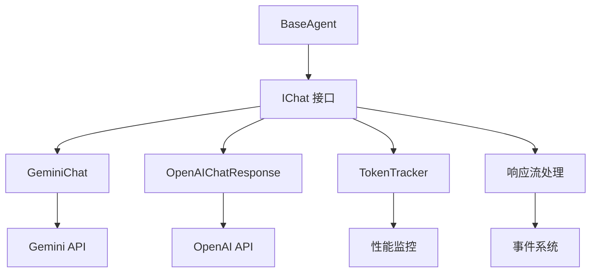

# Chat Provider 系统文档

本目录包含 MiniAgent 的 Chat Provider 系统文档，涵盖多 LLM 支持、Token 管理和响应处理等核心功能。

## 📋 文档列表

### Chat Provider 基础
- **Chat Provider 概览** - 多 LLM 提供商支持的统一接口 *(待完善)*
- **Token 管理** - Token 使用量追踪和优化策略 *(待完善)*

### 具体实现
- **Gemini Chat** - Google Gemini API 集成和配置
- **OpenAI Chat** - OpenAI API 集成和缓存优化
- **响应流处理** - 流式响应的统一处理机制

## 🎯 核心功能

### 统一接口
- **IChat 抽象**: 为不同 LLM 提供统一的调用接口
- **标准化响应**: 统一的响应格式和事件流
- **配置管理**: 灵活的提供商配置选项

### 多 LLM 支持
```typescript
// 支持的 Chat Provider
type ChatProvider = 'gemini' | 'openai';

// 统一的创建方式
const agent = new StandardAgent(tools, {
  chatProvider: 'gemini', // 或 'openai'
  chatConfig: {
    // 提供商特定配置
  }
});
```

### Token 优化
- **实时追踪**: 自动统计输入/输出 Token 使用量
- **缓存机制**: OpenAI 响应缓存优化
- **使用量警告**: 接近限制时的智能提醒

## 🔄 与架构的关系



## 🚀 快速入门

### Gemini 配置
```typescript
const geminiConfig = {
  chatProvider: 'gemini' as const,
  chatConfig: {
    apiKey: process.env.GEMINI_API_KEY,
    modelName: 'gemini-2.0-flash',
    tokenLimit: 100000,
    systemPrompt: 'You are a helpful assistant.'
  }
};
```

### OpenAI 配置
```typescript
const openaiConfig = {
  chatProvider: 'openai' as const,
  chatConfig: {
    apiKey: process.env.OPENAI_API_KEY,
    modelName: 'gpt-4o',
    systemPrompt: 'You are a helpful assistant.',
    // OpenAI 特有配置
    enableCaching: true,
    maxRetries: 3
  }
};
```

## 📊 性能特性

### 流式处理
- **实时响应**: 文本增量更新，无需等待完整响应
- **中断支持**: 支持 AbortSignal 的优雅中断
- **错误恢复**: 自动重试和降级策略

### 缓存优化
- **OpenAI 缓存**: 利用 OpenAI 的 prompt 缓存机制
- **响应缓存**: 本地响应结果缓存
- **Token 节省**: 智能的上下文复用

## 💡 最佳实践

### 选择 Chat Provider
- **Gemini 2.0 Flash**: 速度快，成本低，适合大多数场景
- **GPT-4o**: 功能强大，适合复杂推理任务
- **o1 系列**: 支持深度思考，适合需要复杂推理的场景

### Token 管理
```typescript
// 监控 Token 使用
const usage = agent.getTokenUsage();
if (usage.usagePercentage > 90) {
  console.warn('Approaching token limit!');
  // 实施清理策略
}
```

### 错误处理
```typescript
// 处理 Chat Provider 错误
for await (const event of agent.processWithSession(message)) {
  if (event.type === 'response.failed') {
    // 实现降级或重试逻辑
    console.error('Chat provider error:', event.data);
  }
}
```

## 🔧 扩展指南

### 添加新的 Chat Provider
1. 实现 `IChat` 接口
2. 处理提供商特定的响应格式
3. 集成 Token 追踪机制
4. 添加到 `StandardAgent` 的 provider 选项中

### 自定义 Token 管理
```typescript
class CustomTokenTracker implements ITokenTracker {
  // 实现自定义的 Token 追踪逻辑
}
```

---

**探索 MiniAgent 的 Chat Provider 系统，充分利用多 LLM 的强大能力！**