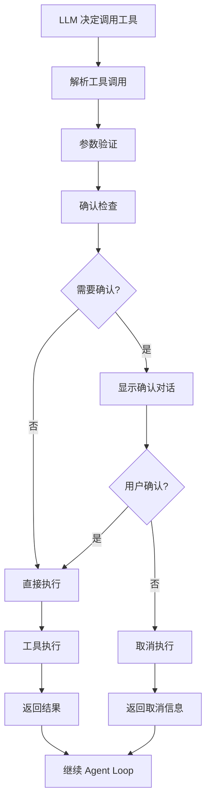

# 工具系统文档

本目录包含 MiniAgent 工具系统的完整文档，涵盖工具定义、执行调度、确认机制等核心功能。

## 📋 文档列表

### 工具开发
- **[自定义工具](./custom-tools.md)** - 完整的工具定义和实现指南

### 工具系统
- **工具调度器** - CoreToolScheduler 的工作原理和配置 *(待完善)*
- **确认机制** - 工具执行的安全确认系统 *(待完善)*

## 🎯 核心概念

### ITool 接口
工具系统基于标准化的 ITool 接口：

```typescript
interface ITool {
  name: string;                    // 工具名称
  description: string;             // 工具描述  
  schema: ToolSchema;              // 参数 schema
  isOutputMarkdown: boolean;       // 输出格式
  canUpdateOutput: boolean;        // 是否可更新输出

  validateToolParams(params: any): string | null;
  getDescription(params: any): string;
  shouldConfirmExecute(params: any): Promise<boolean | ToolCallConfirmationDetails>;
  execute(params: any, abortSignal?: AbortSignal): Promise<ToolResult>;
}
```

### 工具类型分类

#### 只读工具
- 数据查询（天气、股价等）
- 文件读取
- API 调用（不修改状态）

#### 操作工具  
- 文件写入/编辑
- 系统命令执行
- 外部服务调用

#### 交互工具
- 用户输入收集
- 确认对话框
- 进度展示

## 🔄 工具执行流程



## 🚀 快速开始

### 1. 简单工具示例
```typescript
const calculatorTool: ITool = {
  name: 'calculator',
  description: 'Perform mathematical calculations',
  schema: {
    name: 'calculator',
    description: 'Calculate mathematical expressions',
    input_schema: {
      type: 'object',
      properties: {
        expression: {
          type: 'string',
          description: 'Mathematical expression to calculate'
        }
      },
      required: ['expression']
    }
  },
  isOutputMarkdown: false,
  canUpdateOutput: false,

  validateToolParams(params: any): string | null {
    return params.expression ? null : 'Expression is required';
  },

  getDescription(params: any): string {
    return `Calculate: ${params.expression}`;
  },

  async shouldConfirmExecute(): Promise<false> {
    return false; // 数学计算不需要确认
  },

  async execute(params: any): Promise<ToolResult> {
    const result = eval(params.expression); // 注意：生产环境需要安全的求值
    return {
      summary: `Calculated ${params.expression}`,
      llmContent: `The result of ${params.expression} is ${result}`,
      returnDisplay: `${params.expression} = ${result}`
    };
  }
};
```

### 2. 注册工具到 Agent
```typescript
const tools = [calculatorTool, weatherTool, fileReadTool];

const agent = new StandardAgent(tools, {
  chatProvider: 'gemini',
  toolSchedulerConfig: {
    approvalMode: 'yolo', // 自动批准所有工具
    // approvalMode: 'default', // 根据工具决定
    // approvalMode: 'always', // 总是需要确认
  }
});
```

## 📊 工具配置选项

### 批准模式
```typescript
type ApprovalMode = 'yolo' | 'default' | 'always';

// 'yolo' - 自动批准所有工具调用
// 'default' - 根据工具的 shouldConfirmExecute 方法决定  
// 'always' - 始终需要用户确认
```

### 并行执行
```typescript
const toolSchedulerConfig = {
  approvalMode: 'default',
  maxConcurrentTools: 5, // 最大并行工具数
  onToolCallsUpdate: (calls) => {
    console.log(`Active tool calls: ${calls.length}`);
  },
  onAllToolCallsComplete: (completed) => {
    console.log(`Completed ${completed.length} tools`);
  }
};
```

## 🔐 安全和确认机制

### 确认类型
```typescript
interface ToolCallConfirmationDetails {
  type: 'edit' | 'exec' | 'custom';
  title: string;
  fileName?: string;     // 文件编辑确认
  command?: string;      // 命令执行确认
  customData?: any;      // 自定义确认数据
  onConfirm: (outcome: ToolConfirmationOutcome) => Promise<ToolConfirmationOutcome>;
}
```

### 确认结果
```typescript
enum ToolConfirmationOutcome {
  Cancel = 'cancel',           // 取消执行
  ProceedOnce = 'proceed_once', // 仅此次执行
  ProceedAll = 'proceed_all'    // 批准所有同类操作
}
```

## 💡 最佳实践

### 工具设计原则
1. **单一职责**: 每个工具专注一个特定功能
2. **参数验证**: 严格验证输入参数
3. **错误处理**: 优雅处理异常情况
4. **安全考虑**: 危险操作必须实现确认机制

### 性能优化
```typescript
// 使用缓存避免重复计算
const cache = new Map();

async execute(params: any): Promise<ToolResult> {
  const cacheKey = JSON.stringify(params);
  if (cache.has(cacheKey)) {
    return cache.get(cacheKey);
  }
  
  const result = await this.performOperation(params);
  cache.set(cacheKey, result);
  return result;
}
```

### 异步和中断
```typescript
async execute(params: any, abortSignal?: AbortSignal): Promise<ToolResult> {
  const operation = this.performLongRunningTask(params);
  
  return Promise.race([
    operation,
    new Promise((_, reject) => {
      abortSignal?.addEventListener('abort', () => {
        reject(new Error('Operation aborted'));
      });
    })
  ]);
}
```

## 🔧 高级工具模式

### 工具链
多个工具协作完成复杂任务

### 条件工具
根据条件执行不同分支逻辑

### 批量工具
处理大量数据的并行化工具

详细实现请参阅 [自定义工具文档](./custom-tools.md)。

---

**构建强大的自定义工具，扩展 MiniAgent 的无限可能！**